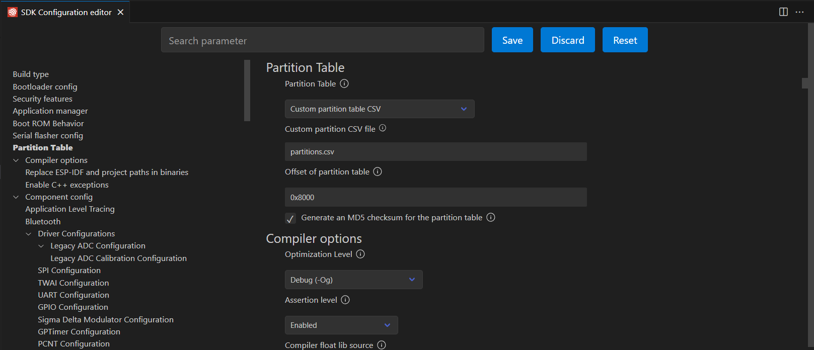
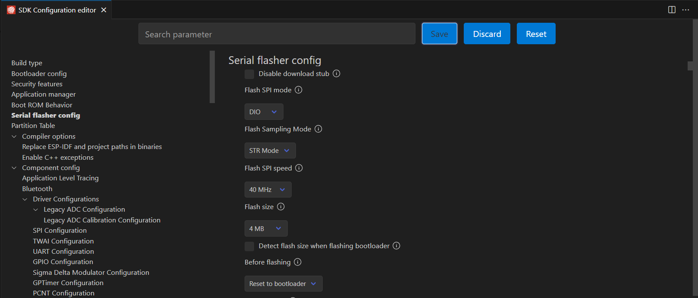

# 6-DOF robot main program

## Add custom components
In order to add additional components to project open new `Bash` terminal in the project directory and run following commands:

```bash
cd components
git clone https://github.com/JanG175/mks_servo.git
git clone https://github.com/JanG175/emm42_servo.git
git clone https://github.com/JanG175/AX_servo.git
```

## Configure SDK
It is necessary to change partition table to custom one (`partitions.csv`) and set flash size to 4 MB. In order to do that go to `menuconfig` and search for:
* `Partition Table` settings



* `Serial flasher config` settings

